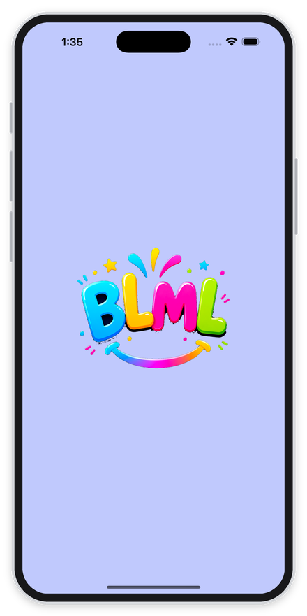
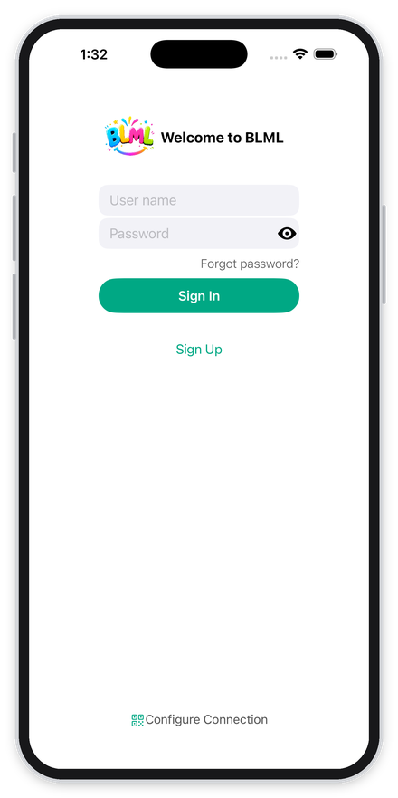
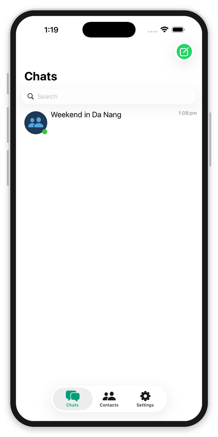
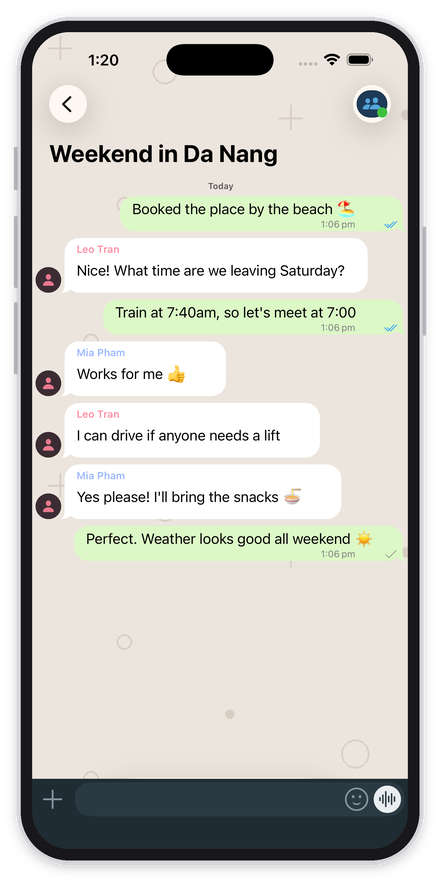
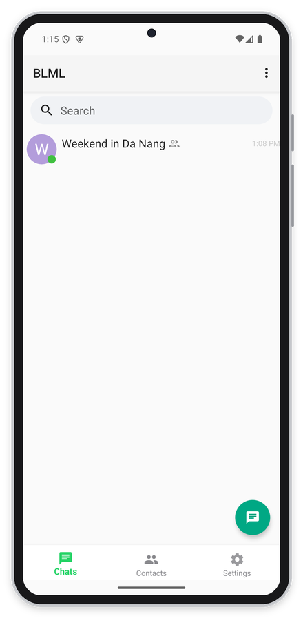
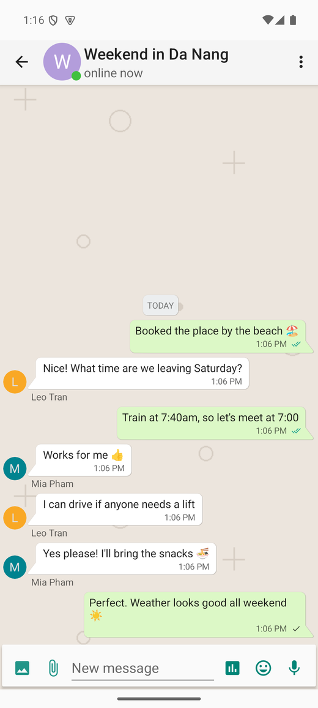
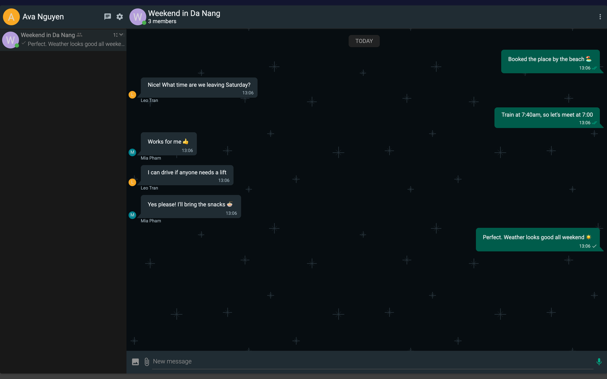

# BLML

A private chat app for the people who actually matter to you — your family, your
close friends, your group.

No ads. No algorithms deciding what you see. No company reading your messages to
sell you things. BLML runs on a server you control, and your conversations,
photos and voice notes stay there.

**Try it: [chat.blml.app](https://chat.blml.app)**

It opens in any browser, no install needed. Creating an account needs an invite
code from whoever runs the server — BLML is invite-only on purpose, so an
address anyone can reach is not a room anyone can walk into.

### On your phone

  
  
  
  

On iPhone

  
  

On Android

### In your browser

  

## What you can do with it

### Talk to people

Message one person or a whole group. You get the things you expect from a modern
messenger: you can see when someone is typing, when your message was delivered,
and when it was read. Reply to a specific message to keep a busy group
conversation straight, edit a message you got wrong, or send a voice note when
typing is too slow.

Share photos, videos, documents and audio — up to 100 MB per file, which is
generous enough for a real video rather than a compressed smear of one.

There is a sticker and emoji panel next to the text box, opening on a page of
the ones people actually use: 👍 ❤️ 🎉 🎂 🙏 😂 and friends.

### Call each other

Voice and video calls go directly between devices where the network allows it,
and fall back to relaying through your server when it doesn't — so calls
connect even when both people are on mobile data behind restrictive networks.

### Keep a group organised

**@mentions** pull someone into a conversation they'd otherwise scroll past.

**Pinned messages** keep the address, the date, or the thing everyone keeps
asking about at the top where nobody has to search for it.

**Polls** let you settle "what are we eating" in one tap each, instead of
forty messages.

**Broadcast channels** are for announcements: admins post, everyone reads, and
nobody can derail it.

**Link previews** show you what a link actually is before you tap it — and the
title is fetched by your own server, so opening a chat doesn't quietly tell a
dozen websites that you're online.

### Find each other

Search by username, scan someone's QR code when you're together, or let the app
match your phone's contacts against members who've added their number. Nothing
is uploaded anywhere except your own server.

### Make it yours

Light, dark, or follow-your-phone themes. A gallery of chat wallpapers served
from your own server, with matching light and dark versions so the app looks
right whichever theme you're in. Adjustable text size, because not everyone in a
family group has the same eyesight.

### Saved messages

Every account gets a private space to send things to yourself — links, notes,
photos you want to find again later.

## Where it runs

**iPhone and iPad**, **Android**, and **any web browser**. All three talk to the
same server, so a conversation looks the same wherever you pick it up, and
history follows you between devices.

## Why it works this way

Most chat apps are free because you are the product. BLML is the other trade:
someone runs a small server, and in return the group's messages belong to the
group.

That has real consequences worth being upfront about. There's no company
guaranteeing uptime — if the server goes down, chat stops until someone restarts
it. And because it's invite-only, growth is deliberate: you hand out a code, not
a download link.

For a family spread across countries, or a group that just wants somewhere
quiet to talk, that's usually the right trade.

## Running your own

The whole thing is open source and designed to run on one cheap server. A small
VPS is plenty — the software idles at around 110 MB of memory, so roughly
$10/month handles a hundred people comfortably.

Setting it up is three commands on a fresh Ubuntu machine, covered step by step
in **[deploy/DEPLOY.md](deploy/DEPLOY.md)**. It brings up the server, gets an
HTTPS certificate automatically, sets up the call relay, and turns on nightly
backups.

Other documentation:

- **[SETUP.md](SETUP.md)** — configuration, phone and email verification, push notifications
- **[BUILDING.md](BUILDING.md)** — building the iOS, Android and web clients yourself

## License

BLML is built on [Tinode](https://github.com/tinode/chat). The server is
licensed under the **GNU GPL v3.0**; the iOS, Android and web clients under the
**Apache License 2.0**. Both licenses and the upstream copyright notices are
preserved in `server/LICENSE`, `ios/LICENSE`, `android/LICENSE` and
`webapp/LICENSE`.
