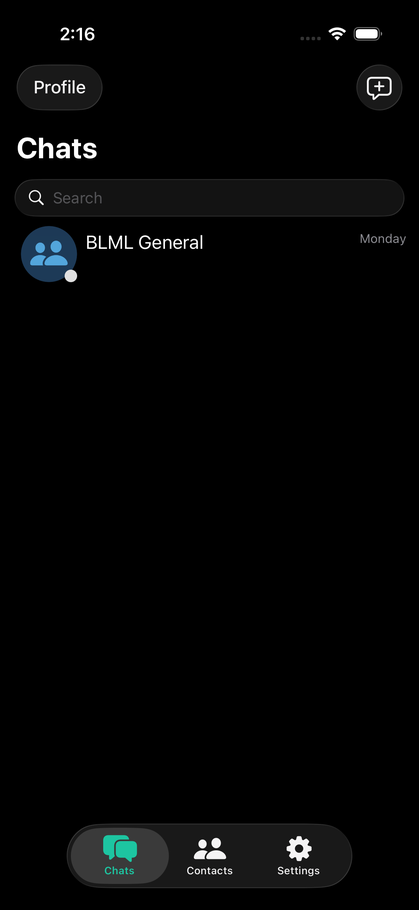
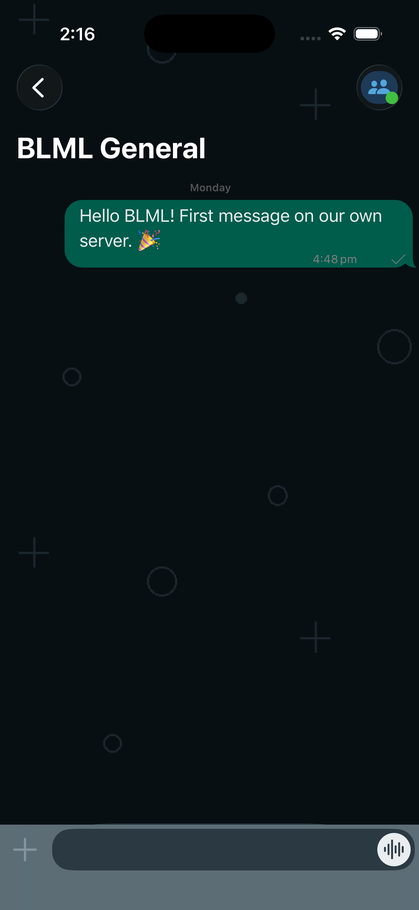
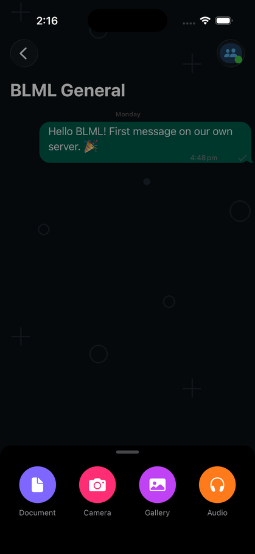
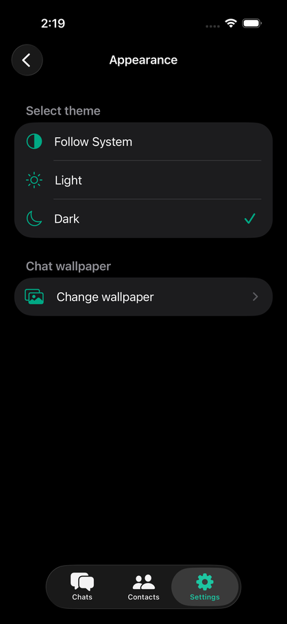
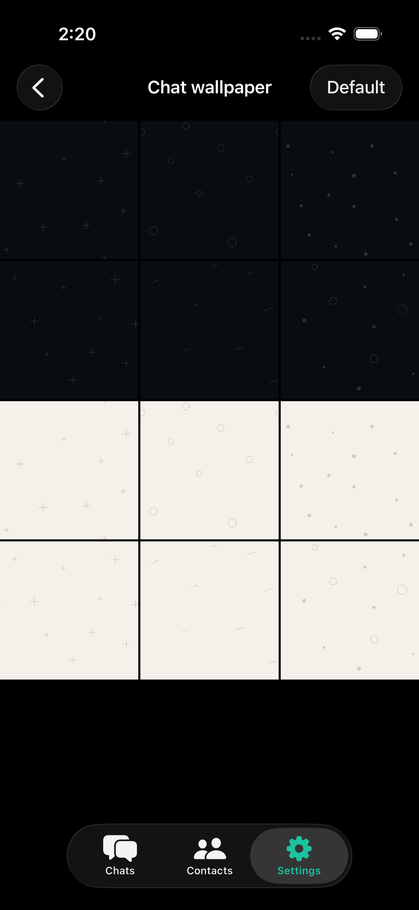

# BLML

A self-hosted, invite-only chat app for a private group — family, friends, a small
team. You run the server; the messages, photos and files stay on your own
machine. No third-party accounts, no ads, no analytics.

Native apps for iOS and Android, plus a web client, all talking to a single Go
server backed by PostgreSQL.

<p align="center">
  
  
  
</p>
<p align="center">
  
  
</p>

## What it does

**Messaging** — one-to-one and group chats, delivery and read receipts, typing
indicators, replies, message editing and voice messages. Attachments up to
100 MB: photos, video, documents, audio.

**Invite-only by design.** Creating an account requires a registration code that
you control. Without it the server refuses signup outright, so a public address
does not mean a public server. *Invite a friend* shares the app, the server
address and the code in one message.

**Finding people** — search by username, scan a QR code in person, or match
against your phone's address book once members add a phone number.

**Voice and video calls** over WebRTC, direct between devices.

**Appearance** — light/dark/system theme and a chat wallpaper gallery served
from your own server, so nothing external is needed to render it.

## Architecture

```
   iOS ─┐
Android ─┼──►  BLML server (Go, :6060)  ──►  PostgreSQL
    Web ─┘         ├── WebSocket + long-polling API
                   ├── serves the web client
                   └── serves uploads
                                │
                          uploads volume
```

One binary does the API, the web client and file uploads. Postgres holds
accounts, messages and file metadata; attachment bytes live on disk.

## Quick start

Requires Docker.

```bash
cd deploy
cp secrets.env.example secrets.env
```

Generate the four secrets and put them in `secrets.env`:

```bash
openssl rand -base64 32   # API_KEY_SALT
openssl rand -base64 32   # AUTH_TOKEN_KEY
openssl rand -base64 16   # UID_ENCRYPTION_KEY
openssl rand -base64 24   # POSTGRES_PASSWORD
```

Set `REGISTRATION_CODE` to whatever you will hand out, then:

```bash
./gen-config.sh
set -a; source secrets.env; set +a
docker compose up -d --build
```

Open <http://localhost:6060>. The first run creates the database schema. No
sample accounts are loaded — create yours through Sign Up.

> **The API key chain.** Changing `API_KEY_SALT` invalidates the key baked into
> the clients. Regenerate it with the in-image keygen and paste the result into
> `webapp/src/config.js`, `android/.../Cache.java` and
> `ios/TinodiosDB/SharedUtils.swift` — all three must match, or that client gets
> `403` on connect.

## Building the clients

| Client | Command |
|---|---|
| Web | `cd webapp && rm -f umd/* && npm install && npm run build` |
| Android | `cd android && ./gradlew :app:assembleDebug` |
| iOS | `cd ios && pod install && open Tinodios.xcworkspace` |

Point the apps at your server: iOS via `dev.xcconfig` / `prod.xcconfig`, Android
via `TindroidApp.getDefaultHostName()`, web via `webapp/src/config.js`.

`ios/install-devices.sh` builds and installs on every paired device at once.
With a free Apple developer account the signature expires after 7 days;
`ios/install-resign-agent.sh` installs a launchd job that reruns it every
Monday and Thursday, skipping devices that are offline.

## Going to production

1. A VPS with 2 vCPU / 4 GB / 40 GB and Docker installed.
2. Point a domain at it.
3. Copy the repo and `secrets.env` (which is **not** in git) to the server.
4. Terminate TLS with Caddy or nginx in front of port 6060, or enable the
   server's built-in ACME.
5. `docker compose up -d --build`.
6. Calls need ICE servers. Public STUN is enough when one side is on home wifi;
   add a TURN relay for calls that always connect.

Backups, phone and email verification, and push notifications are covered in
[SETUP.md](SETUP.md).

## Repository layout

```
server/    Go server and database adapters
ios/       iOS client (Swift)
android/   Android client (Java)
webapp/    Web client (React) and static assets
deploy/    Docker Compose stack and config generator
brand/     Icons, logo, wallpapers and their generator scripts
```

Design notes are in [REDESIGN-PLAN.md](REDESIGN-PLAN.md), operational detail in
[SETUP.md](SETUP.md), build instructions in [BUILDING.md](BUILDING.md).

## Security notes

- `deploy/secrets.env`, the generated `blml.conf` and signing keystores are
  gitignored. Keep them that way.
- Phone verification ships in a no-SMS debug mode: the server accepts a fixed
  code, so a member could claim a number that is not theirs. Fine for a closed
  group, not for a public one — configure Twilio credentials for real
  verification.
- Registration is invite-only, but the code is a shared secret. Rotate it in
  `secrets.env` when someone should no longer be able to invite.

## License

The server is licensed under the **GNU GPL v3.0**; the iOS, Android and web
clients under the **Apache License 2.0**. Both licenses and the upstream
copyright notices are preserved in `server/LICENSE`, `ios/LICENSE`,
`android/LICENSE` and `webapp/LICENSE`.

The BLML name, logo and artwork under `brand/` are not covered by those
licenses.
